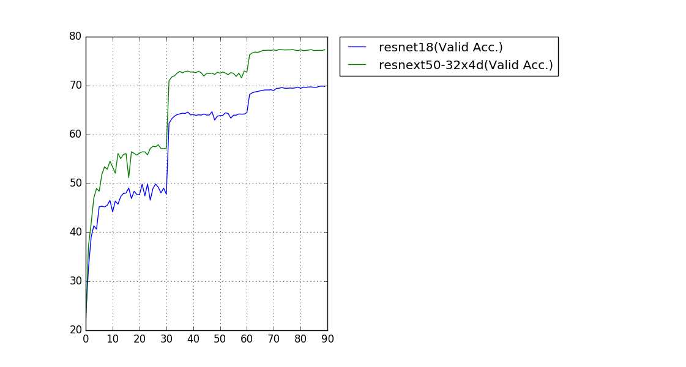

# pytorch-classification
This code origianlly from https://github.com/bearpaw/pytorch-classification.git, which is Classification model on CIFAR-10/100 and ImageNet with PyTorch. Currently have been modified with breast classification trainning and validation. (More detial use check DBT_doc.md)

## Features
* Unified interface for different network architectures
* Multi-GPU support
* Training progress bar with rich info
* Training log and training curve visualization code (see `./utils/logger.py`)

## Install
* Install [CUDA 11.8](https://developer.nvidia.com/cuda-11-8-0-download-archive)
* Install [PyTorch 1.9.0](http://pytorch.org/)
* Install mmcv   
  ```
  pip install openmim
  mim install mmcv==1.9.0
  ```
* Clone mmcls repository

  ```
  git clone https://github.com/open-mmlab/mmclassification.git
  cd mmclassification/
  pip install -e .
  cd ../
  ```

## Training
Please see the [Training recipes](TRAINING.md) for how to train the models.

### ImageNet
Single-crop (224x224) validation error rate is reported. 


| Model                | Params (M)         |  Top-1 Error (%)   | Top-5 Error  (%)   |
| -------------------  | ------------------ | ------------------ | ------------------ |
| ResNet-18            | 11.69              |  30.09             | 10.78              |
| ResNeXt-50 (32x4d)   | 25.03              |  22.6              | 6.29               |



## Pretrained models
Our trained models and training logs are downloadable at [OneDrive](https://mycuhk-my.sharepoint.com/personal/1155056070_link_cuhk_edu_hk/_layouts/15/guestaccess.aspx?folderid=0a380d1fece1443f0a2831b761df31905&authkey=Ac5yBC-FSE4oUJZ2Lsx7I5c).

## Supported Architectures

### CIFAR-10 / CIFAR-100
Since the size of images in CIFAR dataset is `32x32`, popular network structures for ImageNet need some modifications to adapt this input size. The modified models is in the package `models.cifar`:
- [x] [AlexNet](https://arxiv.org/abs/1404.5997)
- [x] [VGG](https://arxiv.org/abs/1409.1556) (Imported from [pytorch-cifar](https://github.com/kuangliu/pytorch-cifar))
- [x] [ResNet](https://arxiv.org/abs/1512.03385)
- [x] [Pre-act-ResNet](https://arxiv.org/abs/1603.05027)
- [x] [ResNeXt](https://arxiv.org/abs/1611.05431) (Imported from [ResNeXt.pytorch](https://github.com/prlz77/ResNeXt.pytorch))
- [x] [Wide Residual Networks](http://arxiv.org/abs/1605.07146) (Imported from [WideResNet-pytorch](https://github.com/xternalz/WideResNet-pytorch))
- [x] [DenseNet](https://arxiv.org/abs/1608.06993)


## Contribute
Feel free to create a pull request if you find any bugs or you want to contribute (e.g., more datasets and more network structures).
